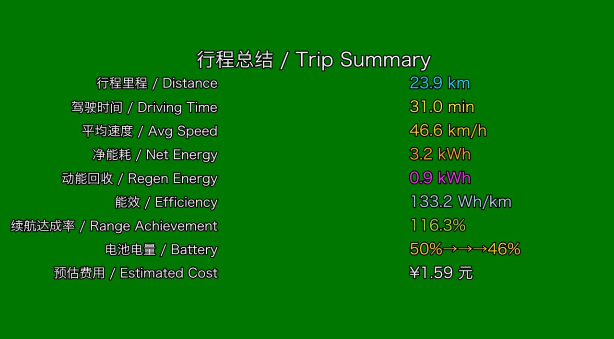
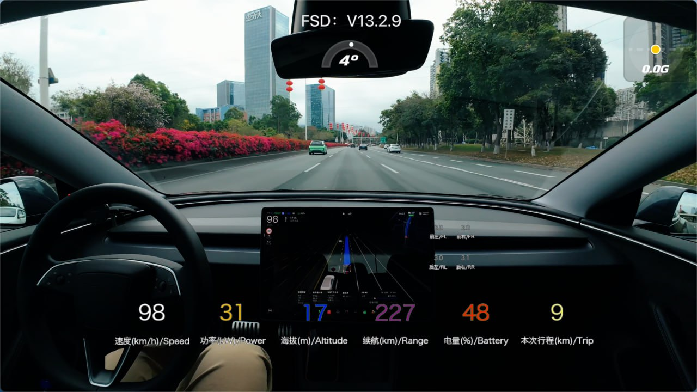

# TeslaMate Drive Visualizer 🚗⚡

将 TeslaMate 行程数据渲染成带实时数据叠加的视频，专为**绿幕扣像合成**设计。

> Render your TeslaMate driving data into a real-time stats overlay video, designed for **green screen (chroma key)** compositing.

**支持平台：macOS / Windows / Linux**

---

## 📸 效果预览

### 实时数据叠加画面


*底部数据栏显示：速度、功率、海拔、续航、电量、气温、本次行程*


*四轮胎压实时显示，颜色区分正常/偏低/偏高*


*行程总结画面：里程、时间、平均速度、能耗统计*

### 画面布局说明

视频画面包含：

```
底部数据栏（绿幕背景）：
[ 速度 ] [ 功率 ] [ 海拔 ] [ 续航 ] [ 电量 ] [ 气温 ] [ 本次行程 ]

中部悬浮：
        前左 前右
        后左 后右     ← 四轮胎压

结尾总结画面（黑色背景）：
行程里程 / 驾驶时间 / 平均速度 / 净能耗 / 动能回收 / 能效 / 续航达成率 / 电池消耗 / 预估费用
```

所有文字带**黑色描边**，扣掉绿色背景后文字依然清晰可见。

---

## ✨ 功能特点

- 🎨 **7项实时数据**：速度、功率、海拔、续航、电量、车外气温、本次行程里程
- 🌈 **动态变色**：速度和功率颜色随数值实时变化
  - 速度：白（静止）→ 黄 → 橙 → 红（高速）
  - 功率：天蓝（回收）→ 白（怠速）→ 黄 → 橙 → 红（大功率）
- 🔵 **四轮胎压**：实时显示，颜色区分正常 / 偏低 / 偏高
- 📋 **行程总结**：视频结尾 2 秒展示完整行程统计
- 🔗 **自动合并**：中断时间短的行程自动合并为一段
- 🟩 **绿幕友好**：所有颜色经过扣像安全性优化，文字带黑色描边
- 📊 **数据插值**：自动对原始数据插值提升视频流畅度
- 💻 **跨平台**：自动识别 macOS / Windows / Linux 并适配中文字体

---

## 🛠️ 依赖环境

| 依赖 | 版本要求 | 说明 |
|------|---------|------|
| Python | 3.8+ | |
| TeslaMate | 任意版本 | 需已运行并记录了行程数据 |
| ffmpeg | 任意版本 | 用于视频编码 |

---

## 📦 安装

### 第一步：克隆仓库

```bash
git clone https://github.com/YOUR_USERNAME/teslamate-drive-visualizer.git
cd teslamate-drive-visualizer
```

### 第二步：安装 Python 依赖

```bash
pip3 install -r requirements.txt
```

### 第三步：安装 ffmpeg

#### macOS
```bash
brew install ffmpeg
```
> 没有 Homebrew？先安装：`/bin/bash -c "$(curl -fsSL https://raw.githubusercontent.com/Homebrew/install/HEAD/install.sh)"`

#### Windows
1. 前往 https://ffmpeg.org/download.html 下载 Windows 版本
2. 解压后将 `bin` 文件夹路径添加到系统环境变量 `PATH`
3. 打开命令提示符，输入 `ffmpeg -version` 验证安装成功

> 也可以用 winget 安装：`winget install ffmpeg`

#### Linux (Ubuntu / Debian)
```bash
sudo apt install ffmpeg
sudo apt install fonts-noto-cjk  # 同时安装中文字体
```

---

## 🔌 连接方式

本脚本通过网络连接 TeslaMate 的 PostgreSQL 数据库。

> ⚠️ **重要：TeslaMate 默认不对外暴露数据库端口**
> 
> TeslaMate 的 `docker-compose.yml` 中，`database` 服务默认只在 Docker 内部通信，没有开放端口供外部连接。**必须先修改配置文件才能使用本脚本。**

---

### 第一步：修改 TeslaMate 的 docker-compose.yml

找到你的 `docker-compose.yml` 文件，在 `database:` 服务下添加 `ports` 映射：

**修改前（默认）：**
```yaml
database:
  image: postgres:16
  restart: always
  environment:
    - POSTGRES_USER=teslamate
    - POSTGRES_PASSWORD=your_password
    - POSTGRES_DB=teslamate
  volumes:
    - teslamate-db:/var/lib/postgresql
```

**修改后（添加 ports）：**
```yaml
database:
  image: postgres:16
  restart: always
  environment:
    - POSTGRES_USER=teslamate
    - POSTGRES_PASSWORD=your_password
    - POSTGRES_DB=teslamate
  volumes:
    - teslamate-db:/var/lib/postgresql
  ports:
    - 55432:5432    # 格式：外部端口:内部端口
                    # 左边 55432 是你从外部连接时用的端口（可自定义）
                    # 右边 5432 是 PostgreSQL 内部固定端口（不要修改）
```

> 💡 **外部端口可以自定义**，只要不与系统其他服务冲突即可。
> 例如改成 `5433:5432` 或 `15432:5432` 都可以，对应脚本里的 `DB_PORT` 也要同步修改。

---

### 第二步：重启 TeslaMate 使配置生效

```bash
# 在 docker-compose.yml 所在目录执行
docker compose down
docker compose up -d
```

---

### 第三步：在脚本中填写连接信息

#### 本地连接（脚本和 TeslaMate 在同一台电脑）

```python
DB_HOST = "localhost"
DB_PORT = 55432        # 与 docker-compose.yml 中左边的端口一致
DB_PASSWORD = "你的密码"
```

#### 网络连接（TeslaMate 在局域网其他设备，如 NAS、树莓派）

```python
DB_HOST = "192.168.1.100"   # 运行 TeslaMate 那台设备的 IP
DB_PORT = 55432
DB_PASSWORD = "你的密码"
```

> 💡 **如何查找设备 IP？**
> - 路由器管理页面 → 已连接设备列表
> - 在 TeslaMate 所在设备上运行：`ip addr`（Linux）/ `ipconfig`（Windows）

> 💡 **密码在哪里？**
> 打开 `docker-compose.yml`，找到 `POSTGRES_PASSWORD=` 后面的值即为密码。

---

## ⚙️ 配置

打开 `drive_visualizer.py`，修改顶部配置区域：

```python
# 数据库
DB_HOST = "localhost"            # 本地连接用 localhost，远程填 IP
DB_PORT = 55432
DB_PASSWORD = "YOUR_DB_PASSWORD"

# 费用
ELECTRICITY_PRICE = 0.5          # 电费单价（元/度），根据当地电价修改

# 能效基准（用于计算续航达成率）
STANDARD_EFFICIENCY = 155        # Wh/km
# 参考值：
#   Model 3 Performance    ≈ 155 Wh/km
#   Model 3 后驱            ≈ 135 Wh/km
#   Model Y Performance    ≈ 175 Wh/km
#   Model Y 后驱            ≈ 150 Wh/km

# 时区
LOCAL_TIMEZONE = 'Asia/Shanghai'
```

### 常用时区参考

| 地区 | 时区字符串 |
|------|-----------|
| 中国大陆 | `Asia/Shanghai` |
| 台湾 | `Asia/Taipei` |
| 香港 | `Asia/Hong_Kong` |
| 日本 | `Asia/Tokyo` |
| 英国 | `Europe/London` |
| 美国东部 | `America/New_York` |
| 美国西部 | `America/Los_Angeles` |

---

## ▶️ 使用方法

#### macOS / Linux
```bash
python3 drive_visualizer.py
```

#### Windows
```cmd
python drive_visualizer.py
```

程序运行后按提示操作：

```
1. 程序自动连接数据库并列出车辆
   → 输入车辆序号（通常是 0）按回车

2. 显示最近 20 条行程（自动合并间隔小于 10 分钟的行程）
   → 输入要生成的行程序号按回车

3. 自动生成视频
   → 完成后保存到当前目录，文件名如 drive_merged_123.mp4
```

---

## 🎬 扣像合成建议

生成的视频背景为**纯绿色（#00FF00）**，可在以下软件中进行绿幕扣像：

| 软件 | 操作路径 |
|------|---------|
| Final Cut Pro | 效果 → 抠像 → 色度抠像 |
| DaVinci Resolve | Color 页面 → Qualifier → 吸取绿色 |
| Adobe Premiere Pro | 效果 → 键控 → Ultra Key |
| OBS Studio | 滤镜 → 色度键 |
| 剪映 | 画中画 → 智能抠图 → 色度抠图 |

> 💡 所有数字和标签均带有黑色描边，扣除绿色后文字仍然清晰，无需担心边缘溢色。

---

## 📁 文件结构

```
teslamate-drive-visualizer/
├── drive_visualizer.py   # 主程序
├── requirements.txt      # Python 依赖
├── .gitignore            # Git 忽略规则
├── LICENSE               # MIT 许可证
└── README.md             # 本文件
```

---

## 🔧 常见问题

**Q: 连接数据库失败**
- 确认 `DB_HOST` 填写正确（本地用 `localhost`，远程用设备 IP）
- 确认已按 README「🔌 连接方式」章节在 docker-compose.yml 中添加了 `ports` 映射并重启
- 检查密码是否正确（见 `docker-compose.yml` 中的 `POSTGRES_PASSWORD=`）
- 网络连接时确认两台设备在同一局域网，且防火墙未拦截对应端口

**Q: Windows 提示找不到 python3**
- Windows 通常使用 `python`（不带 3）：`python drive_visualizer.py`
- 安装 Python 时请勾选 "Add Python to PATH"

**Q: 提示 `ffmpeg not found`**
- macOS：`brew install ffmpeg`
- Windows：下载后确认已添加到 PATH，重启终端后再试
- 验证方法：在终端输入 `ffmpeg -version`

**Q: 中文字体显示为方块**
- macOS：通常不会出现，系统自带中文字体
- Windows：控制面板 → 时间和语言 → 语言，确认已安装中文语言包
- Linux：`sudo apt install fonts-noto-cjk`

**Q: 气温显示为 0**
- 部分旧版 TeslaMate 或车辆不记录车外温度，程序会自动处理，不影响其他数据

**Q: 视频生成速度很慢**
- 降低 `INTERPOLATION_FACTOR`（默认 4，可改为 2）
- 降低 `FPS`（默认 30，可改为 24）
- 在 `ani.save(...)` 处将 `dpi=100` 改为 `dpi=72`

---

## 🚗 已测试车型

- Model 3 Performance

理论上支持所有 TeslaMate 记录的车型。如果你在其他车型上测试成功，欢迎提 Issue 告知！

---

## 🤝 贡献

欢迎提交 Issue 和 Pull Request！

1. Fork 本仓库
2. 创建功能分支：`git checkout -b feature/amazing-feature`
3. 提交改动：`git commit -m 'Add amazing feature'`
4. 推送分支：`git push origin feature/amazing-feature`
5. 提交 Pull Request

---

## 📄 License

MIT License — 详见 [LICENSE](LICENSE) 文件。

你可以自由使用、修改、分发本项目，包括商业用途，只需保留原始版权声明。

---

## 🙏 致谢

- [TeslaMate](https://github.com/teslamate-org/teslamate) — 优秀的特斯拉数据记录工具
- [Matplotlib](https://matplotlib.org/) — 视频帧渲染

---

## 💖 赞助支持

如果这个项目对你有帮助，欢迎赞助支持！

| 微信支付 | 支付宝 |
|:--------:|:------:|
|  |  |

你的支持将帮助项目持续更新和维护！🙏
